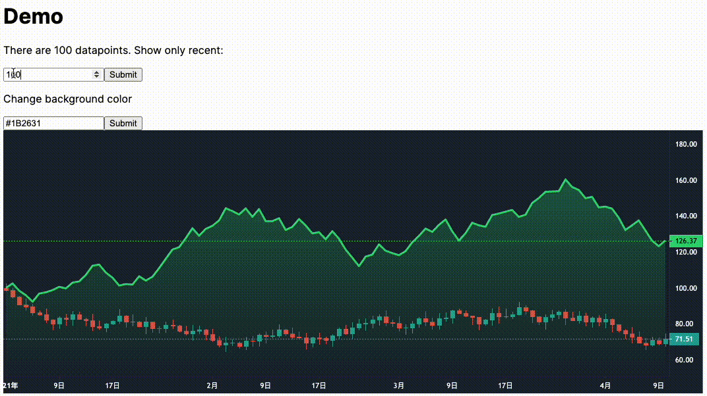

<div style="text-align: center">
<h1>🎛 Dash Tradingview Lightweight Charts Component 📊</h1>
</div>

Dash Tradingview Lightweight Charts Components is a Dash component library. This component wraps the popular [TradingView Lightweight Charts by TradingView](https://github.com/tradingview/lightweight-charts) written in Typescript/Javascript, and renders it for use in Python [Dash](https://dash.plotly.com/) apps.

## Releases

| Date        | Tag|
| ----------- | ------ |
| 23 Feb 2023 | v0.1.0 |

## Installation

This package is available in PyPI:

```
pip install dash_tvlwc
```

## Demo

### Chart and series style options
- 1-to-1 chart and series option capability as in original lightweight chart
- See `./example/options.py`


### Interactivity with [Dash callbacks](https://dash.plotly.com/basic-callbacks)
- Modify data or styles on any triggers
- See `./example/interactivity.py`


### Minimal example
```python
series_data = [{'time': '2020-01-01', 'value': 10.0}, ...]

series_options = [{
    'lineColor': '#FFAA30',
    'topColor': '#2962FF',
    'priceLineWidth': 3,
    'priceLineColor': 'red'
}]

chart_options = {
    'layout': {
        'background': {'type': 'solid', 'color': '#1B2631'},
        'textColor': 'white',
    },
    'grid': {
        'vertLines': {'visible': False},
        'horzLines': {'visible': False},
    },
    'localization': {'locale': 'en-US'}
}

dash_tvlwc.Tvlwc(
    id='bar-chart',
    seriesData=[series_data],
    seriesTypes=['bar'],
    seriesOptions=[series_options]
    width='100%',
    chartOptions=chart_options
)
```

## References: Chart properties

The Tradingview Lightweight Chart library is highly customizable in style. For the complete list of chart options and series options available, please refer to [the official API document](https://tradingview.github.io/lightweight-charts/docs/api).

**Configurable props**

- `id`: identifiable ID for the chart.
- `chartOptions`: a dict of options on chart canvas.
- `seriesData`: a list series of list of timepoint dicts on series data.
- `seriesTypes`: a list of series types, in the same order as `seriesData`.
- `seriesOptions`: a list of series option dict for each series, in the same order as `seriesData`.
- `seriesMarkers`: a list of list of markers dicts for each series, in the same order as `seriesData`.
- `seriesPriceLines`: a list of list of price line dicts for each series, in the same order as `seriesData`.
- `width`: width of outer container of the chart.
- `height`: height of outer container of the chart.

**Read-only props**
- `crosshair`: position of last mouse hover on chart (crosshair coordinates).
- `click`: position of last mouse click on chart (click coordinates).
- `fullChartOptions`: full dict of applied chart options including default options.
- `fullPriceScaleOptions`: full dict of applied series options including default options.
- `timeRangeVisibleRange`: from-to dates of visible time range.
- `timeRangeVisibleLogicalRange` from-to numbers of visible time range.
- `timeScaleWidth`: width of time scale.
- `timeScaleHeight`: height of time scale.
- `fullTimeScaleOptions`: full dict of applied time scale options including default options.

## Contributing

See [CONTRIBUTING.md](./CONTRIBUTING.md)

## Development

1. Install Dash and its dependencies: https://dash.plotly.com/installation
2. Run demonstration script with `python example/usage.py`
3. Visit the demo Dash app at http://localhost:8050 in your web browser

### Install dependencies

If you have selected install_dependencies during the prompt, you can skip this part.

1. Install npm packages
    ```
    $ npm install
    ```
2. Create a virtual env and activate.
    ```
    $ virtualenv venv
    $ . venv/bin/activate
    ```
    _Note: venv\Scripts\activate for windows_

3. Install python packages required to build components.
    ```
    $ pip install -r requirements.txt
    ```
4. Install the python packages for testing (optional)
    ```
    $ pip install -r tests/requirements.txt
    ```

### Write your component code in `src/lib/components/Tvlwc.react.js`.

- The demo app is in `src/demo` and you will import your example component code into your demo app.
- Test your code in a Python environment:
    1. Build your code
        ```
        $ npm run build
        ```
    2. Run and modify the `usage.py` sample dash app:
        ```
        $ python usage.py
        ```
- Write tests for your component.
    - A sample test is available in `tests/test_usage.py`, it will load `usage.py` and you can then automate interactions with selenium.
    - Run the tests with `$ pytest tests`.
    - The Dash team uses these types of integration tests extensively. Browse the Dash component code on GitHub for more examples of testing (e.g. https://github.com/plotly/dash-core-components)
- Add custom styles to your component by putting your custom CSS files into your distribution folder (`dash_tvlwc`).
    - Make sure that they are referenced in `MANIFEST.in` so that they get properly included when you're ready to publish your component.
    - Make sure the stylesheets are added to the `_css_dist` dict in `dash_tvlwc/__init__.py` so dash will serve them automatically when the component suite is requested.
- [Review your code](./review_checklist.md)

### Create a production build and publish:

1. Build your code:
    ```
    $ npm run build
    ```
2. Create a Python distribution
    ```
    $ python setup.py sdist bdist_wheel
    ```
    This will create source and wheel distribution in the generated the `dist/` folder.
    See [PyPA](https://packaging.python.org/guides/distributing-packages-using-setuptools/#packaging-your-project)
    for more information.

3. Test your tarball by copying it into a new environment and installing it locally:
    ```
    $ pip install dash_tvlwc-0.0.1.tar.gz
    ```

4. If it works, then you can publish the component to NPM and PyPI:
    1. Publish on PyPI
        ```
        $ twine upload dist/*
        ```
    2. Cleanup the dist folder (optional)
        ```
        $ rm -rf dist
        ```
    3. Publish on NPM (Optional if chosen False in `publish_on_npm`)
        ```
        $ npm publish
        ```
        _Publishing your component to NPM will make the JavaScript bundles available on the unpkg CDN. By default, Dash serves the component library's CSS and JS locally, but if you choose to publish the package to NPM you can set `serve_locally` to `False` and you may see faster load times._

5. Share your component with the community! https://community.plotly.com/c/dash
    1. Publish this repository to GitHub
    2. Tag your GitHub repository with the plotly-dash tag so that it appears here: https://github.com/topics/plotly-dash
    3. Create a post in the Dash community forum: https://community.plotly.com/c/dash
