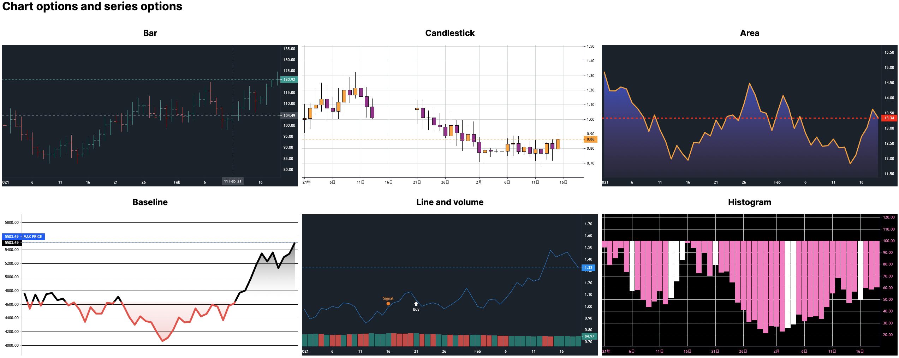
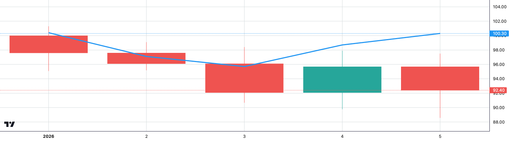

<div style="text-align: center">
<h1>🎛 Dash Tradingview Lightweight Charts Component 📊</h1>

[Source Code](https://github.com/tysonwu/dash-tradingview) | [Documentation](https://dash-tradingview.readthedocs.io/) | [Live Demo](http://tysonwu.pythonanywhere.com/)

</div>

Dash Tradingview Lightweight Charts Components is a Dash component library. This component wraps [TradingView's Lightweight Charts](https://github.com/tradingview/lightweight-charts), the popular financial charting library written in Javascript, and extends it for use in Python [Dash](https://dash.plotly.com/) webapp.

## Releases

| Date        | Tag    |
| ----------- | ------ |
| 23 Feb 2023 | v0.1.1 |

## Installation

This package is available in PyPI:

```
pip install dash_tvlwc
```

## Demo

### Interactive demo

An interactive demo hosted and available [here](http://tysonwu.pythonanywhere.com/). The source code of this live demo can be found at `./demo/app.py`.

>> The demo hosting on pythonanywhere somehow suffers from very slow callbacks. Fixing this soon.

### Chart and series style options
- 1-to-1 chart and series option capability as in original lightweight chart
- See `./example/options.py`


### Interactivity with [Dash callbacks](https://dash.plotly.com/basic-callbacks)
- Modify data or styles on any triggers
- See `./example/interactivity.py`


### Minimal example

The source code of this minimal example can be found at `./demo/minimal_example.py`.

1. Import dependencies
```python
import dash
from dash import html
import dash_tvlwc
```

2. Make some random candlestick data and line plot data
```python
candlestick_data = [
    {'close': 97.56, 'high': 101.29, 'low': 95.07, 'open': 100, 'time': '2021-01-01'},
    {'close': 96.06, 'high': 99.06, 'low': 95.17, 'open': 97.56, 'time': '2021-01-02'},
    {'close': 92.06, 'high': 98.39, 'low': 90.72, 'open': 96.06, 'time': '2021-01-03'},
    {'close': 95.74, 'high': 97.87, 'low': 89.75, 'open': 92.06, 'time': '2021-01-04'},
    {'close': 92.44, 'high': 97.5, 'low': 88.56, 'open': 95.74, 'time': '2021-01-05'},
    {'close': 89.31, 'high': 93.1, 'low': 85.20, 'open': 92.44, 'time': '2021-01-06'},
    {'close': 85.10, 'high': 93.08, 'low': 82.23, 'open': 89.31, 'time': '2021-01-07'},
    {'close': 81.87, 'high': 88.34, 'low': 77.97, 'open': 85.10, 'time': '2021-01-08'},
    {'close': 79.55, 'high': 82.44, 'low': 76.08, 'open': 81.87, 'time': '2021-01-09'},
    {'close': 82.74, 'high': 84.01, 'low': 78, 'open': 79.55, 'time': '2021-01-10'}
]

line_data = [
    {'time': '2021-01-01', 'value': 100.35},
    {'time': '2021-01-02', 'value': 97.09},
    {'time': '2021-01-03', 'value': 95.74},
    {'time': '2021-01-04', 'value': 98.72},
    {'time': '2021-01-05', 'value': 100.3},
    {'time': '2021-01-06', 'value': 95.8},
    {'time': '2021-01-07', 'value': 91.22},
    {'time': '2021-01-08', 'value': 94.26},
    {'time': '2021-01-09', 'value': 94.9},
    {'time': '2021-01-10', 'value': 94.85}
]
```

3. Initialize Dash app and add the Tvlwc component
```python
app = dash.Dash(__name__)
app.layout = html.Div(children=[
    dash_tvlwc.Tvlwc(
        seriesData=[candlestick_data, line_data],
        seriesTypes=['candlestick', 'line'],
    ),
])

if __name__ == '__main__':
    app.run_server()
```

4. Run the app by `python minimal_example.py`. The app should be running on `localhost:8050/`. You should see the plot:



## References: Chart properties

The Tradingview Lightweight Chart library is highly customizable in style. For the complete list of chart options and series options available, please refer to [the official API documentation](https://tradingview.github.io/lightweight-charts/docs/3.8).

**Configurable props**

|Property |Description  |
|---|---|
|`chartOptions`|a dict of options on chart canvas.|
|`seriesData`|a list series of list of timepoint dicts on series data.|
|`seriesTypes`|a list of series types, in the same order as `seriesData`.|
|`seriesOptions`|a list of series option dict for each series, in the same order as `seriesData`.|
|`seriesMarkers`|a list of list of markers dicts for each series, in the same order as `seriesData`.|
|`seriesPriceLines`|a list of list of price line dicts for each series, in the same order as `seriesData`.|
|`width`|width of outer container of the chart.|
|`height`|height of outer container of the chart.|

**Read-only props**

|Property |Description  |
|---|---|
|`id`|identifiable ID for the chart.|
|`crosshair`|position of last mouse hover on chart (crosshair coordinates).|
|`click`|position of last mouse click on chart (click coordinates).|
|`fullChartOptions`|full dict of applied chart options including default options.|
|`fullPriceScaleOptions`|full dict of applied series options including default options.|
|`timeRangeVisibleRange`|from-to dates of visible time range.|
|`timeRangeVisibleLogicalRange`|from-to numbers of visible time range.|
|`timeScaleWidth`|width of time scale.|
|`timeScaleHeight`|height of time scale.|
|`fullTimeScaleOptions`|full dict of applied time scale options including default options.|

## Contributing

See [CONTRIBUTING.md](./CONTRIBUTING.md)

## Development

### Requirements

- Node.js 18 or newer, npm 9 or newer
- Python 3.9 or newer

### Verified compatibility

| Dash   | React  | Status                                  |
| ------ | ------ | --------------------------------------- |
| 4.4.1  | 18.3.1 | Works                                   |
| 3.4.0  | 18.3.1 | Works                                   |
| 3.0.0  | 18.3.1 | Works                                   |
| 2.18.2 | 16.14  | Works, but below the declared floor      |

The package declares `dash>=3.0.0`. Dash 3.0.0 and 2.18.2 need Python 3.13 or older, as they call `pkgutil.find_loader`, which was removed in Python 3.14.

### Set up

Run all commands from the repository root.

1. Install npm packages.
    ```
    $ npm install
    ```
2. Create a virtual environment and activate it.
    ```
    $ python -m venv venv
    $ . venv/bin/activate
    ```
    _Note: `venv\Scripts\activate` on Windows._

3. Install the Python packages required to build the component.
    ```
    $ pip install -r requirements.txt
    ```

### Build

```
$ npm run build
```

This runs two stages, which can also be run separately:

- `npm run build:js` bundles `src/lib` into `dash_tvlwc/dash_tvlwc.min.js` with webpack.
- `npm run build:backends` generates the Python, R, and Julia classes from `src/lib/components/Tvlwc.tsx`. The virtual environment must be active so that `dash-generate-components` is on `PATH`.

`npm run typecheck` runs `tsc --noEmit` over the TypeScript sources without producing a bundle.

### Try the component in a Dash app

The component currently accepts `id`, `chartOptions`, `width`, and `height`. Series props are not yet wired up, so the chart renders as an empty pane with axes and no data.

Save the following as `app.py` in the repository root, so that `import dash_tvlwc` picks up your local build rather than an installed copy:

```python
import dash
from dash import html
import dash_tvlwc

app = dash.Dash(__name__)
app.layout = html.Div([
    dash_tvlwc.Tvlwc(
        id='chart',
        width='100%',
        height=400,
        chartOptions={
            'layout': {
                'background': {'type': 'solid', 'color': '#ffffff'},
                'textColor': '#333333',
            },
            'timeScale': {'timeVisible': True},
        },
    ),
])

if __name__ == '__main__':
    app.run(debug=True)
```

Run it with `python app.py` and visit http://localhost:8050. With `debug=True`, prop types are validated in the browser and any mismatch is reported in the console.

### Try the component without Dash

```
$ npm start
```

This serves `src/demo` through webpack-dev-server at http://localhost:8080 and renders `Tvlwc.tsx` directly in React. It rebuilds on save and does not require the Python bindings, which makes it the faster loop when working on the component itself.

### Bundled examples

The apps under `demo/` and `example/` target the earlier prop schema and raise `TypeError: ... received an unexpected keyword argument: 'seriesTypes'` against the current component. They are kept as references and are updated as the series props are reintroduced.