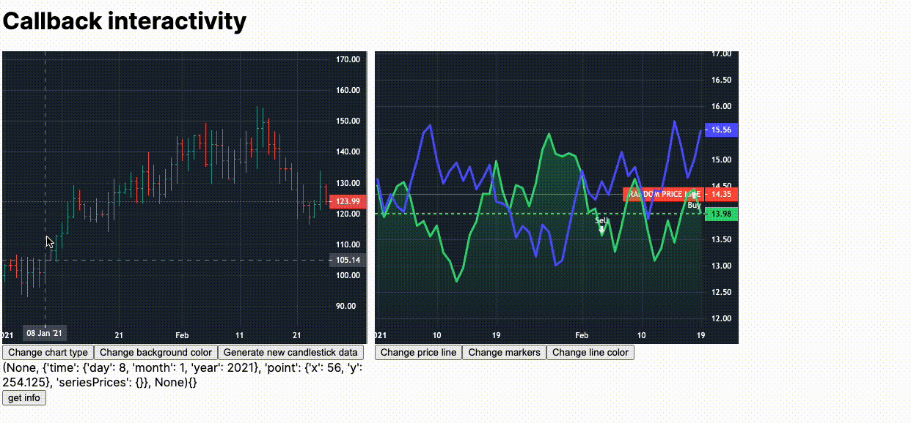

# Callback example

This example shows the possibility of callbacks.

[Please read the example here from source code](https://github.com/tysonwu/dash-tradingview/blob/main/examples/interactivity.py).

